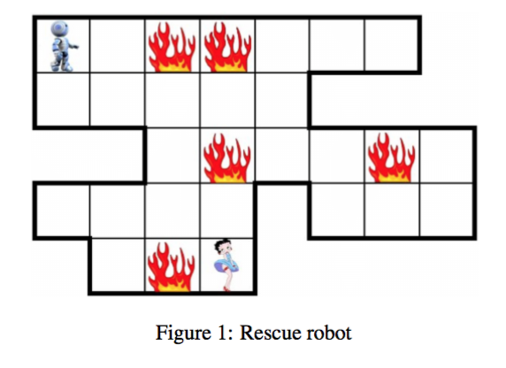

##1 Description of the Project

The mission of the robot is to assist firefighters in rescue operations. The robot explores a predefined area partitioned into zones, looking for the victims of a fire. When a victim is found, the robot must transmit a signal with their location to the rescue mission control centre. The intensity of the fire in each zone varies over time: in a burning zone, the intensity can both increase and decrease, whereas a safe zone can catch fire from its neighbourghs. The robot is fire-resistant to a certain degree, beyond which it permanently fails.


Our goal is to design the control software for the robot in order to ensure basic functionality and safety of the robot. We are not required to implement any particular search algorithm, but you have to make sure that such an algorithm can be easily integrated on top of your software.

##2 System requirements
There are following modules to comprise the robot:

1. The Engine can perform two actions: rotate the robot or advance it forward into the zone it is facing.

2. A Heat sensor can measure the temperature in the robot’s environment and signal whether it falls into one of the predifined intervals. (You can decide how many sensors you want to use and what are the preconfigured temperature intervals.)

3. The Navigation system detects whether the robot is facing a wall or the border of the region it is confined to and whether it has found a victim.

4. The Transmitter is a simple device that can only send the current location data to the rescue mission control centre.

In order to ensure the safety of the robot the following (minimum) requirements must be satisfied:

1. The robot must not advance and rotate at the same time.

2. The robot must not leave its predefined mission area.

3. The robot must not crash into walls.

4. The robot must remain in zones, where the heat intensity is below the robot’s failure level.

5. When the robot finds a victim it must transmit their location to the rescue mission control centre. 

6. The robot operation must always be based on recent measurement information.

##3 Our Plan
1. Using Petri Nets to describe our system.
2. Design the BIP model and define structural operational semantics of our robot system.
3. Prove the safety and functionality of our system.
4. Implement our model and using it to generate executable code.

Reference:
[BIP Tools](http://www-verimag.imag.fr/The-BIP-Design-Flow.html)
